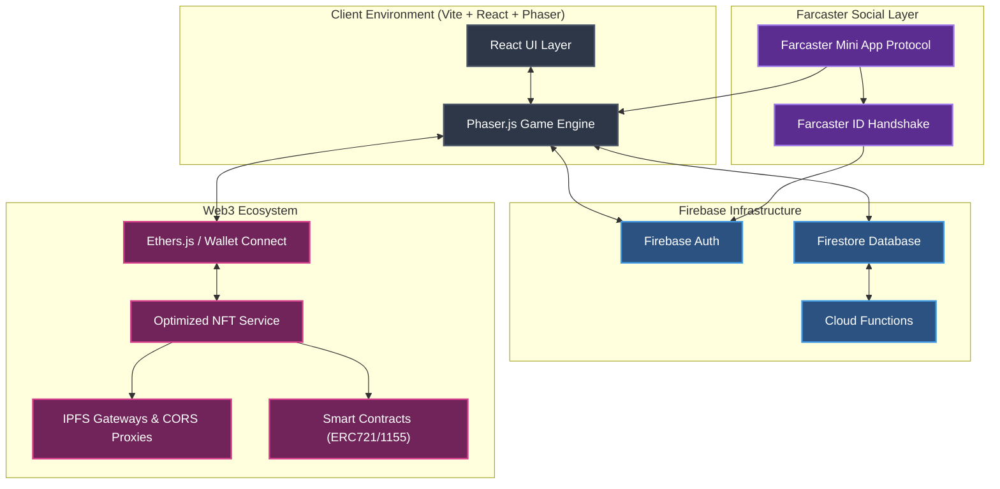

# Engineering Portfolio Report: QuiztalWorld

**Project Overview:** 
QuiztalWorld is an interactive, educational Web3 game built using **Phaser.js, TypeScript, React, and Firebase**, integrated heavily with the Ethereum blockchain and Farcaster social protocols. 

As a core software engineer on this project, I architected and implemented critical game mechanics, high-performance Web3 infrastructure, responsive UI/UX systems, and complex state management solutions. This document outlines the key technical contributions and features I developed, serving as a comprehensive demonstration of my software engineering capabilities for remote roles in the US.

---

## 🛠 Core Technology Stack
- **Frontend:** TypeScript, HTML5 Game Graphics (Phaser.js), Vite.js
- **Backend & State:** Firebase (Firestore, Auth, Functions), Persistent LocalStorage mapping
- **Web3 & Blockchain:** Ethers.js, WalletConnect, Mint.club SDK, Farcaster Mini App Protocol
- **Architecture Patterns:** Object-Oriented Programming (OOP) for game entities, Event-driven architecture, Component-based UI, Service Layer pattern

### System Architecture Diagram

---

## 🚀 Key Engineering Contributions & Features Implemented

### 1. High-Performance Web3 & NFT Infrastructure
*Demonstrates: API Optimization, Concurrency, Fault Tolerance, Caching Strategies*

* **Optimized NFT Detection Service**: Engineered a modular TypeScript service to replace legacy sequential NFT fetching. 
  * Implemented parallel fetching of NFT metadata using `Promise.allSettled` for concurrent processing.
  * Built an in-memory caching mechanism with configurable expiration to drastically reduce redundant blockchain API calls.
  * Designed an robust fallback chain for resilient IPFS image loading (Direct IPFS → CORS Proxies → Cloudflare/Pinata → Local Fallback), ensuring UI stability regardless of node availability.
  * Integrated an exponential backoff automatic retry logic for failed requests.

### 2. Complex AI & Gameplay State Systems
*Demonstrates: Game Loop Optimization, AI State Machines, State Management*

* **Field Monster Roaming System (AI)**: Developed a grid-based spatial AI system utilizing population control mechanics.
  * Created a centralized singleton `MonsterManager` to actively monitor and dynamically spawn entities, maintaining a controlled geographic population density.
  * Programmed physics-driven entity movement algorithms with state transitions (Idle → Roam → Chase) triggered by spatial proximity thresholds (player detection range).
* **Dynamic Stamina & Economy System**: Implemented a continuous tick-based state mechanic that integrates with the core Phaser game loop.
  * Synchronized delta-time mathematically to calculate precise stamina drain (movement/speed boosts) and regeneration (idle states) scaling at 60 FPS.
  * Managed event listeners to intercept NPC interactions, cleanly deducting state variables and interrupting active regeneration timers.

### 3. Progressive Web App & Farcaster Mini-App Architecture
*Demonstrates: Cross-platform Integration, Protocol standards, Auth abstraction*

* **Farcaster Protocol Integration**: Architected the game to run seamlessly as a native Farcaster Mini App embedded within frames.
  * Extended Firebase Auth to conditionally generate custom tokens and handle secure handshakes using Farcaster IDs (FIDs).
  * Implemented programmatic environment detection to dynamically adjust viewport, render quality, and frame-rate caps strictly optimized for Farcaster's embedded mobile constraints.
  * Packaged custom Vite build scripts targeting specialized bundle outputs for the Mini App wrapper.

### 4. Cross-Platform UI/UX & Input Engineering
*Demonstrates: Responsive Design, Human-Computer Interaction, Memory Management*

* **Consumable Hotkey System**: Engineered a real-time reactive UI mapping numeric keyboard events (`1-0`) to persistent inventory slots.
  * Architected cross-scene communication fetching inventory data without breaking modular scene separation.
  * Implemented local-storage serialization to permanently persist user peripheral bindings across sessions.
* **Mobile Physics & Virtual Controls**: Designed specialized mobile-first input interfaces with velocity smoothing algorithms. 
  * Re-programmed the virtual joystick's internal math to eliminate animation flickering and instantly halt momentum upon pointer-release, creating a premium gameplay feel.
  * Designed complex multi-layered HUD panels (Wallet Verification UI) using programmatic Phaser graphics arrays, featuring dynamic hover-state animations and performance-friendly gradient fills.

### 5. Seamless World Traversal Mechanics
*Demonstrates: State Persistence, Memory Cleanup, Scene Transitions*

* **Cross-Map Teleportation Architecture**: Set up persistent data handoffs parsing robust initial state objects between independent game scenes.
  * Managed strict memory garbage collection during scene drops (`GameScene` <-> `ExplorationScene`).
  * Engineered a device-agnostic trigger logic supporting both discrete DOM events (desktop KeyDown) and simulated analog actions (mobile touch boundaries) mapped to the identical callback cycle.

---

## 💼 Software Engineering Competencies Highlighted

1. **System Design & Architecture**: Proven ability to break down monolithic mechanics into modular, scalable, and independent classes (`MonsterManager`, `OptimizedNFTService`).
2. **Performance Optimization**: Deep understanding of mitigating expensive operations—evidenced by active Web3 cache implementations, draw-call reductions, and efficient memory allocations inside tight runtime loops.
3. **Resiliency & Error Handling**: Proactive design of multi-tiered fallback handlers and graceful degradation circuits ensuring maximum uptime for the end user.
4. **Clean Code & Documentation**: Consistent structural planning using TypeScript interfaces, detailed markdown implementations, automated build separation, and strict adherence to OOP methodologies.
5. **Product-Minded Engineering**: Cross-functional capability combining deep backend mathematics with engaging, physics-driven frontend UX to create polished products.
