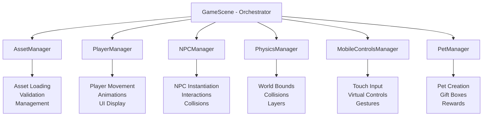

# 🏗️ Modular GameScene Architecture Documentation

## 📋 Overview

This document describes the refactored **modular architecture** for the GameScene in Crystle World. The original monolithic 900+ line GameScene has been transformed into a clean, maintainable, and scalable architecture using the **Manager Pattern** and **Separation of Concerns** principles.

## 🎯 Architecture Goals

- **Modularity**: Break down large monolithic code into focused, single-responsibility modules
- **Maintainability**: Make code easier to understand, modify, and debug
- **Scalability**: Allow easy addition of new features without affecting existing code
- **Testability**: Enable unit testing of individual components
- **Reusability**: Create components that can be used across different scenes

## 📐 Architecture Overview



## 🔧 Manager Classes

### 1. **AssetManager** (`src/managers/AssetManager.ts`)

**Responsibility**: Centralized asset loading and management

**Key Features**:
- Organized asset loading by category (NPCs, Player, UI, Audio, Pets)
- Asset validation and error handling
- Configurable asset parameters
- Asset key mapping and retrieval

**Usage**:
```typescript
const assetManager = AssetManager.getInstance(scene);
assetManager.loadAllAssets();

// Get NPC asset keys
const huntboyAssets = assetManager.getNPCAssetKeys('huntboy');
// { avatarKey: 'npc_huntboy_avatar', spriteKey: 'npc_huntboy' }
```

### 2. **NPCManager** (`src/managers/NPCManager.ts`)

**Responsibility**: Complete NPC lifecycle management

**Key Features**:
- Automated NPC instantiation with configurable positions
- Centralized interaction handling
- Physics collision setup
- Anti-spam manager integration
- Proximity detection and cooldown management

**Usage**:
```typescript
const npcManager = NPCManager.getInstance(scene, player);
npcManager.initializeAllNPCs();
npcManager.setupPhysicsColliders();

// Handle interactions
const success = npcManager.handleNPCInteraction('C');
```

### 3. **PlayerManager** (`src/managers/PlayerManager.ts`)

**Responsibility**: All player-related functionality

**Key Features**:
- Player sprite initialization and setup
- Movement and animation handling
- NFT title and name display
- Player UID assignment
- Visual effects (glow, aura)

**Usage**:
```typescript
const playerConfig = {
  selectedCharacter: 'lsxd',
  startPosition: { x: 800, y: 750 },
  speed: 160
};

const playerManager = PlayerManager.getInstance(scene, playerConfig);
const player = playerManager.initializePlayer();
playerManager.createPlayerAnimations();
```

### 4. **MobileControlsManager** (`src/managers/MobileControlsManager.ts`)

**Responsibility**: Touch input and mobile device support

**Key Features**:
- Automatic mobile device detection
- Virtual joystick and button creation
- Touch event handling
- Network connectivity checks
- Responsive control positioning

**Usage**:
```typescript
const mobileManager = MobileControlsManager.getInstance(scene, playerManager, networkMonitor);
mobileManager.initializeMobileControls();

// Check if mobile
const isMobile = mobileManager.getIsMobile();
```

### 5. **PhysicsManager** (`src/managers/PhysicsManager.ts`)

**Responsibility**: Physics world setup and collision management

**Key Features**:
- Tilemap layer creation and management
- World bounds configuration
- Collision detection setup
- Physics object management
- Layer depth and collision properties

**Usage**:
```typescript
const physicsManager = PhysicsManager.getInstance(scene);
physicsManager.initializePhysicsWorld(tilemap, tileset);
physicsManager.setupPlayerCollisions(player);
```

### 6. **PetManager** (`src/managers/PetManager.ts`)

**Responsibility**: Pet system and gift box mechanics

**Key Features**:
- NFT eligibility checking
- Moblin pet creation and management
- Gift box collection system
- Reward calculation and distribution
- Pet behavior and teleportation

**Usage**:
```typescript
const petManager = PetManager.getInstance(scene, player, networkMonitor);
petManager.initializePetSystem();

// Handle pet interactions
const success = await petManager.handleMoblinInteraction('O');
```

## 🔄 Before vs After Comparison

### **BEFORE - Monolithic GameScene (900+ lines)**
```typescript
export default class GameScene extends Phaser.Scene {
  // 20+ private properties scattered throughout
  private player!: Phaser.Physics.Arcade.Sprite;
  private huntboy!: HuntBoy;
  private mintGirl!: MintGirl;
  // ... 10+ more NPCs
  private joyStick?: Phaser.GameObjects.Image;
  // ... many more properties

  preload() {
    // 60+ lines of asset loading code
    this.load.image("npc_huntboy_avatar", "assets/npc/npc_huntboy_avatar.png");
    this.load.spritesheet("npc_huntboy", "assets/npc/npc_huntboy_idle_1.png", {
      frameWidth: 32, frameHeight: 53,
    });
    // ... 60+ more asset loading calls
  }

  async create() {
    // 150+ lines of mixed initialization code
    // NPCs, physics, player, mobile controls all mixed together
    this.huntboy = new HuntBoy(this, 500, 1100);
    this.mintGirl = new MintGirl(this, 1050, 1100);
    // ... physics setup mixed with NPC creation
    this.physics.add.collider(this.player, this.huntboy);
    // ... mobile controls mixed with everything else
  }

  private handleNPCTrigger(key: string) {
    // 50+ lines of repetitive distance calculations
    const distanceToHuntBoy = Phaser.Math.Distance.Between(this.player.x, this.player.y, this.huntboy.x, this.huntboy.y);
    const distanceToMintGirl = Phaser.Math.Distance.Between(this.player.x, this.player.y, this.mintGirl.x, this.mintGirl.y);
    // ... 10+ more distance calculations
    
    if (key === "C") {
      if (distanceToHuntBoy <= 100) {
        this.huntboy.interact();
      } else if (distanceToMintGirl <= 100) {
        this.mintGirl.interact();
      }
      // ... 10+ more if-else chains
    }
  }
}
```

### **AFTER - Modular GameScene (200 lines)**
```typescript
export default class GameScene extends Phaser.Scene {
  // Clean, focused properties
  private player!: Phaser.Physics.Arcade.Sprite;
  private selectedCharacter: string = 'lsxd';

  // Manager instances
  private assetManager!: AssetManager;
  private npcManager!: NPCManager;
  private playerManager!: PlayerManager;
  private mobileControlsManager!: MobileControlsManager;
  private physicsManager!: PhysicsManager;
  private petManager!: PetManager;

  preload() {
    // 3 lines total!
    this.assetManager = AssetManager.getInstance(this);
    this.assetManager.loadAllAssets();
  }

  async create() {
    // Clean, organized initialization
    await this.initializeScene();
    await this.initializeCoreSystem();
    this.setupWorldAndPhysics();
    this.initializePlayer();
    this.initializeNPCs();
    this.setupInputHandling();
    this.initializeMobileControls();
    this.initializePetSystem();
    await this.initializePlayerUI();
    this.finalizeSetup();
  }

  private handleInteraction(key: string): void {
    // Clean delegation to managers
    switch (key) {
      case 'C':
        this.npcManager.handleNPCInteraction('C');
        break;
      case 'O':
        this.petManager.handleMoblinInteraction('O');
        break;
    }
  }
}
```

## 📊 Benefits Achieved

### **1. Code Reduction**
- **GameScene**: 900+ lines → 200 lines (-78% reduction)
- **Complexity**: Mixed responsibilities → Single responsibility per class
- **Readability**: Difficult to follow → Clear, documented flow

### **2. Maintainability**
- **Bug Fixes**: Changes isolated to specific managers
- **Feature Addition**: Add new NPCs by updating NPCManager config
- **Testing**: Each manager can be unit tested independently

### **3. Scalability**
- **New Features**: Easy to add without touching existing code
- **Performance**: Managers can be optimized independently
- **Memory**: Better resource management with proper cleanup

### **4. Developer Experience**
- **Debugging**: Issues isolated to specific managers
- **Documentation**: Each manager has clear API and purpose
- **Collaboration**: Multiple developers can work on different managers

## 🚀 Usage Guidelines

### **Adding a New NPC**

1. **Add to NPCManager configuration**:
```typescript
// In NPCManager.ts
{
  id: 'newcharacter',
  name: 'New Character',
  class: NewCharacter,
  position: { x: 300, y: 400 },
  interactionRange: 100
}
```

2. **Add assets to AssetManager**:
```typescript
// In AssetManager.ts
{
  avatarKey: 'npc_newcharacter_avatar',
  avatarPath: 'assets/npc/npc_newcharacter_avatar.png',
  spriteKey: 'new_character',
  spritePath: 'assets/npc/npc_newcharacter_idle_1.png',
  frameWidth: 32,
  frameHeight: 64
}
```

That's it! No need to modify GameScene at all.

### **Modifying Mobile Controls**

```typescript
// Update configuration
mobileControlsManager.updateConfig({
  joystickScale: 1.5,
  buttonScale: 1.4,
  joystickAlpha: 0.8
});

// Or completely customize
mobileControlsManager.setMobileMode(true); // Force mobile mode for testing
```

### **Adding Physics Objects**

```typescript
// Easy collision setup
physicsManager.addCollision(objectA, objectB);
physicsManager.addOverlap(objectA, objectB, callback);

// Utility methods
const inBounds = physicsManager.isPositionInBounds(x, y);
const distance = physicsManager.getDistanceBetween(objA, objB);
```

## 🧪 Testing Strategy

Each manager can be tested independently:

```typescript
// Example: Testing NPCManager
describe('NPCManager', () => {
  it('should initialize all NPCs correctly', () => {
    const npcManager = NPCManager.getInstance(mockScene, mockPlayer);
    npcManager.initializeAllNPCs();
    
    const validation = npcManager.validateNPCs();
    expect(validation.valid).toBe(true);
  });

  it('should handle NPC interactions', () => {
    const success = npcManager.handleNPCInteraction('C');
    expect(success).toBe(true);
  });
});
```

## 🔧 Debug Tools

Each manager provides debug information:

```typescript
// Get comprehensive debug info
const debugInfo = gameScene.getDebugInfo();

// Get specific manager debug info
const npcDebug = npcManager.getDebugInfo();
const playerDebug = playerManager.getDebugInfo();

// Validate all systems
const validation = gameScene.validateSystems();
if (!validation.valid) {
  console.warn('Issues found:', validation.issues);
}
```

## 📈 Performance Considerations

1. **Lazy Loading**: Managers are instantiated only when needed
2. **Singleton Pattern**: Prevents multiple instances of managers
3. **Resource Cleanup**: Proper destroy methods prevent memory leaks
4. **Event Optimization**: Centralized event handling reduces listeners

## 🔮 Future Extensibility

This architecture makes it easy to add:

- **AudioManager**: Centralized sound management
- **EffectsManager**: Visual effects and particles
- **CameraManager**: Advanced camera controls
- **InventoryManager**: Player inventory system
- **DialogManager**: Enhanced dialog system
- **SaveManager**: Game state persistence

## 📝 Migration Guide

To migrate existing code to this architecture:

1. **Identify Responsibilities**: Group related functionality
2. **Create Manager**: Move functionality to appropriate manager
3. **Update GameScene**: Replace direct calls with manager calls
4. **Test**: Ensure functionality works with new architecture
5. **Cleanup**: Remove old code and add proper documentation

## 🎉 Conclusion

This modular architecture transforms a difficult-to-maintain monolithic GameScene into a clean, professional, and scalable codebase. Each manager has a clear purpose, making the code easier to understand, test, and extend.

The separation of concerns ensures that changes to one system don't affect others, and the standardized API across managers provides consistency throughout the codebase.

**Result**: A maintainable, scalable, and professional game architecture that supports rapid development and easy debugging.